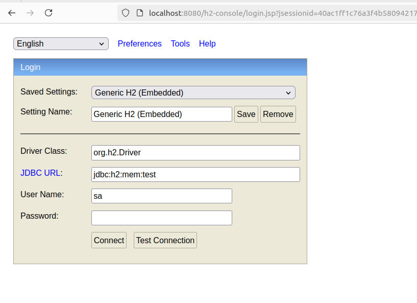

When the application is started, we can connect to the h2 DB at this url: http://localhost:8080/h2-console  
With these informations, we can see the tables and request them:

Vous pouvez trouver la classe PersonRepository [ici](src/main/java/com/example/demo/repo/PersonRepository.java).

    public interface PersonRepository extends CrudRepository<Person, Long>, QueryByExampleExecutor<Person>

The repository should extends both class: CrudRepository and QueryByExampleExecutor. 
It is not possible to have 2 Repositories: one that extends CrudRepository and an other one that extends QueryByExampleExecutor. 

<h3>ExampleMatcher.matching()</h3>
When we use: *ExampleMatcher.matching()*  
all the attributs should be mentioned. They should be present either in the personQuery Object or in the *.withIgnorePaths*

    Example<Person> ex = Example.of(personQuery, matcher);

<h3>ExampleMatcher.matchingAny()</h3>
With mathingAny, we can ignore some columns.

